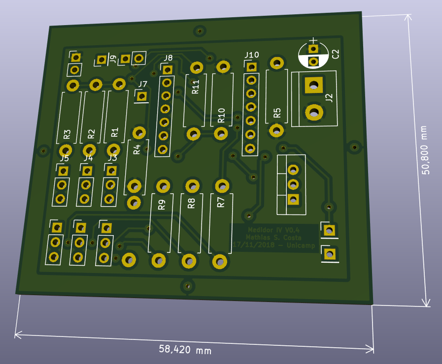
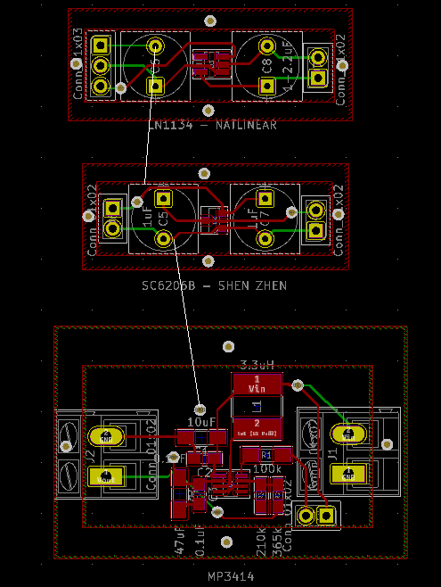
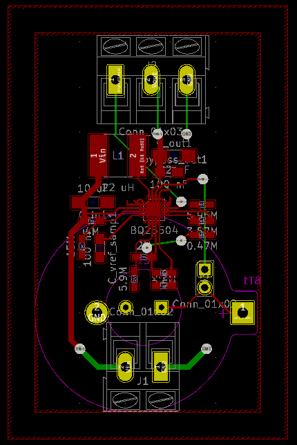

# Master degree schematics folder

At the root of this directory you will find some projects developed at my master degree at UNICAMP. Each one is classified from a project to another.

## IV Measurement (Kicad 4.0)

Design of a single cell I-V measurement circuit.

## High Speed Op. Amp. Socket (Kicad 4.0)

Design of a socket for Gansil GS8051 op. amp.

## Low Voltage DC-DC

Designs for DC-DC with at least 0,8 V for cold start.

The initial problem of this kind of circuit is the leakage current and the high switching frequency. The tricky point for correctly assemble the system is the inductors and capacitors selection: Inductos with low series resistance (<0.1 Ohm) and capacitors XR7. It's all about energy loss. All resistive component makes loss. Not only, some layout strategies may count for better performance. The preference is to keep elements of the circuit close to the IC, avoiding EMC, tracks resistance and noise at the feedback pins. 

### MP3414 (Kicad 4.0)

Low cost (US$0,2 at LCSC.com) Step-up converter

### BQ25504 (Kicad 4.0)

High cost (US$4,6 at ti.com) Energy Harvesting Power Management IC 

## NRF51822 Socket (Kicad 5.0)

This project is a simple socket for NRF51822 radio uC. The schematics includes programming pins, one led and a trimpot for analog read signals. 
