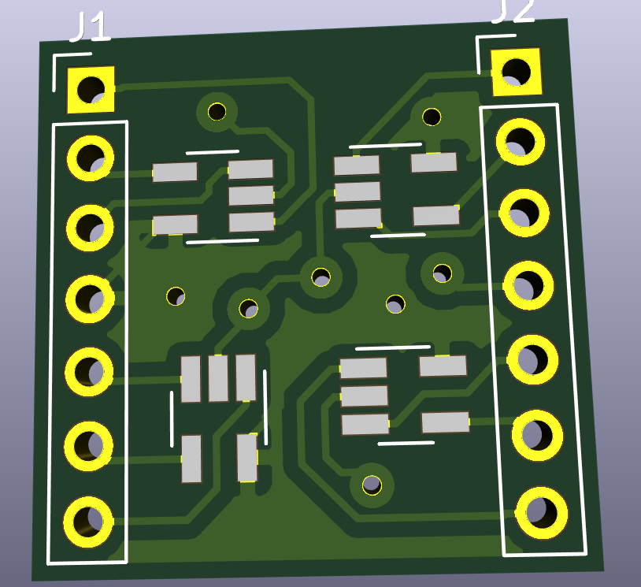

# Master degree schematics folder

At the root of this directory you will find some projects developed at my master degree at UNICAMP. Each one is classified from a project to another.

## IV Measurement

Design of a single cell I-V measurement circuit.

## High Speed Op. Amp. Socket

Design of a socket for Gansil GS8051 op. amp.

